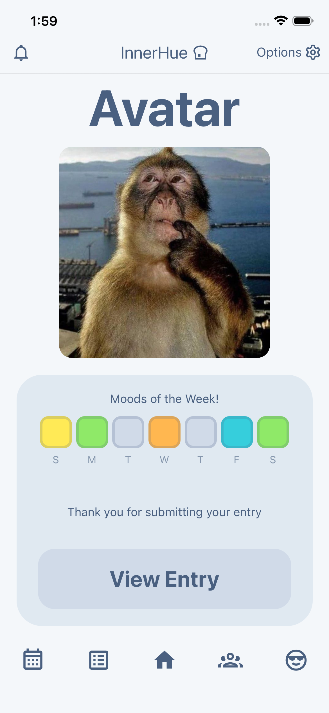
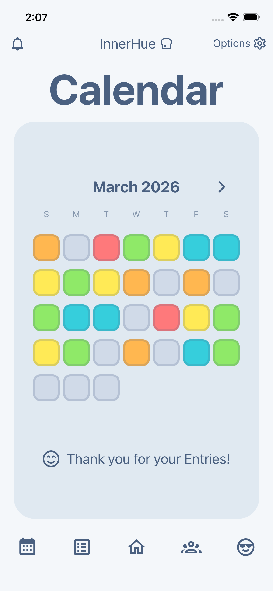
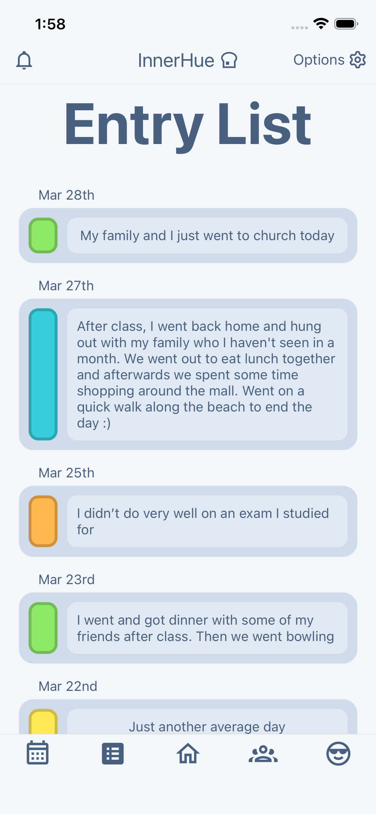
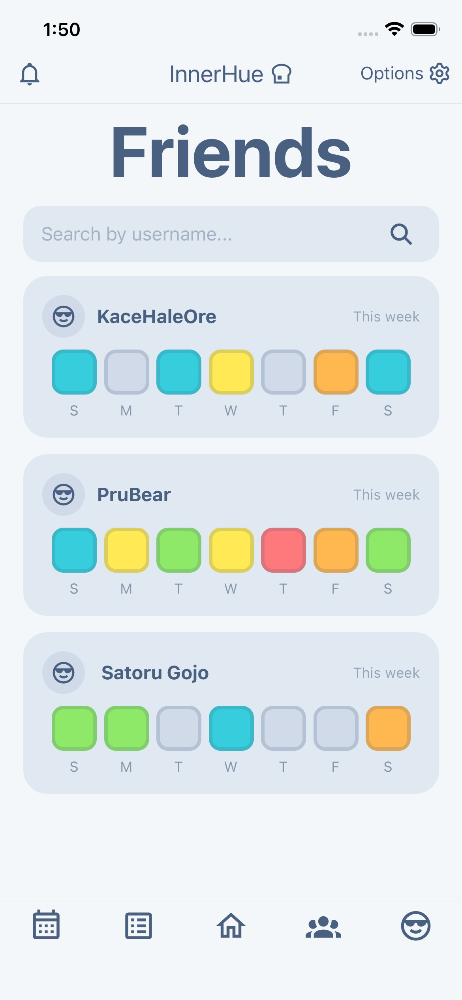
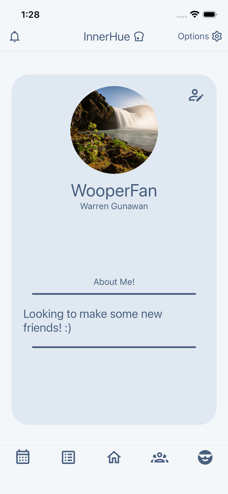
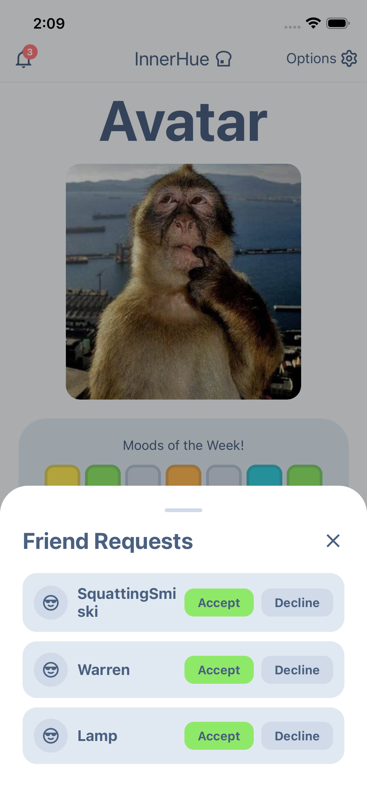

# 🧠 InnerHue

A social mental health tracker that helps users reflect, connect, and stay consistent in documenting their mental health

---

<p align="center">
  
  
  
</p>

---

## ✨ Overview

InnerHue is a mental health tracking app that allows users to log daily moods and reflect through journaling. It includes friending capabilites to promote connection with friends and openness with ones mental health. It combines self-reflection with social accountability to encourage consistency and awareness.

---

## 💡 Why I Built This

I built InnerHue because I wanted a simple and meaningful way for myself and those close to me to stay consistent with reflecting on my mental health. Many apps felt too complex or isolating, so I wanted to create something that was both minimal and social, making it easier to stay accountable and connected. 

---

## 📱 Screens & Features

### 🏠 Home / Daily Entry
<p align="center">
  
</p>

- Enter experienced mood and any additional notes for today
- Information is locked oncec submitted and can be reopened to see what was entered

---

### 📅 Calendar View
<p align="center">
  
</p>

- Visual overview of one's monthly mood history
- Color-coded entries for quick insights
- Shifting window to view past monthly entries and future months to come

---

### 📝 Entry List / Journaling
<p align="center">
  
</p>

- Users can view past entries
- Supports detailed reflections and note taking 

---

### 👥 Friends & Social Tracking
<p align="center">
  
</p>

- View friends' weekly mood activity
- Encourages accountability and connection
- Friend others based off of username

---

### 🙋 Profile & Customization
<p align="center">
  
  
</p>

- Custom profile with avatar and bio
- Editable user information

---

### 🔔 Friend Requests
<p align="center">
  
</p>

- Accept or decline requests
- Manage social connections
- Notified when a request is sent to the user

---

## 🚀 Features

### Core Features
- Daily mood tracking
- Journaling / reflections
- Calendar-based visualization
- Persistent data storage

### Social Features
- Add friends
- View friends' mood activity
- Friend requests system

### Additional Features
- Profile customization
- Avatar selection

---

## 🏗️ App Structure

```bash
/app
  /components     # Reusable UI components
  /screens        # Main screens (Home, Calendar, Friends, Profile)
  /services       # Firebase / API logic
  /hooks          # Custom hooks
  /utils          # Helper functions
